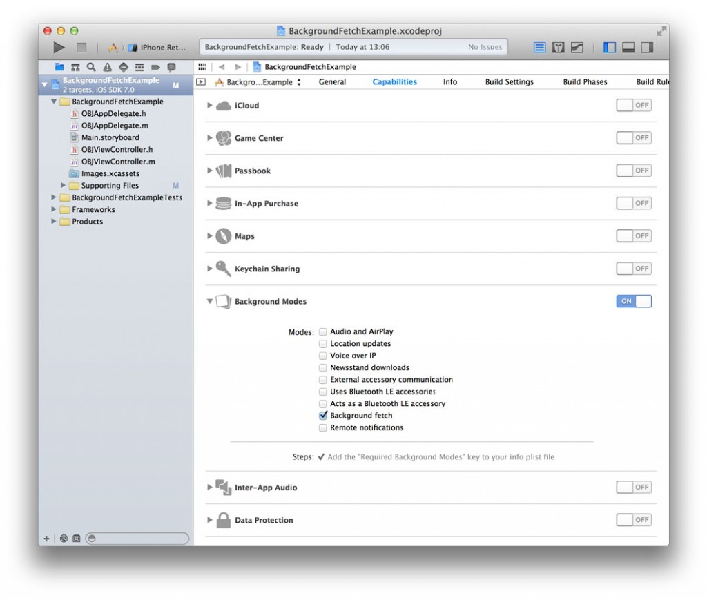
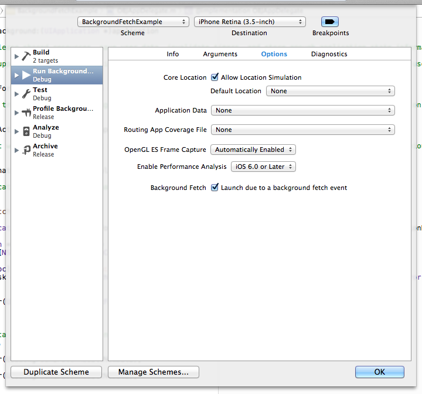

### 变更记录
| 序号 | 录入时间 | 录入人 | 备注 |
| -- | -- | -- | -- |
| 1 | 2015-03-03 | Alfred Jiang | - |

### 方案名称
网络 - iOS7 的多任务处理——后台获取（Background Fetch）

### 方案类型（推荐 or 参考）
推荐方案

### 关键字
多任务处理 \ 后台获取数据 \ Background Fetch \ Remote Notification

### 需求场景
1. 在程序进入后台的情况下，如果你想要下载一部很大的视频以便离线观看，或者将用户图片备份到服务器时

### 参考链接
1. [iOS 7系列译文：iOS7的多任务处理](http://www.kuqin.com/shuoit/20131223/337138.html)

### 详细内容

1. 在info plist文件中的UIBackgroundModes健值指定使用的特性。
        <key>UIBackgroundModes</key>
        <array>
        <string>fetch</string>
        </array>

 最简单的途径是在Xcode5的project editor中新的性能标签页中（Capabilities tab）设置，这个标签页包含了后台模式部分,可以方便配置多任务选项。
 

2. 告诉iOS你希望多久进行一次后台获取
        - (BOOL)application:(UIApplication *)application didFinishLaunchingWithOptions:(NSDictionary *)launchOptions
        {
            [application setMinimumBackgroundFetchInterval:UIApplicationBackgroundFetchIntervalMinimum];
            return YES;
        }

 iOS默认不进行后台获取，所以你需要设置一个时间间隔，否则，你的应用程序永远不行在后台进行获取数据。UIApplicationBackgroundFetchIntervalMinimum这个值要求系统尽可能经常去管理应用程序什么时候会被唤醒，但如果不需要这个值，你应该指定你的时间间隔。例如，一个天气的应用程序，可能只需要几个小时才更新一次，iOS将会在后台获取之间至少等待你指定的时间间隔。

 如果你的应用允许用户退出登录，那么就没有获取新数据的需要了，你应该把minimumBackgroundFetchInterval设置为UIApplicationBackgroundFetchIntervalNever，这样可以节省资源。

3. 在应用程序委托中实现下列方法
        - (void) application:(UIApplication *)application
        performFetchWithCompletionHandler:(void (^)(UIBackgroundFetchResult))completionHandler
        {
            NSURLSessionConfiguration *sessionConfiguration = [NSURLSessionConfiguration defaultSessionConfiguration];
            NSURLSession *session = [NSURLSession sessionWithConfiguration:sessionConfiguration];
            NSURL *url = [[NSURL alloc] initWithString:@"http://yourserver.com/data.json"];
            NSURLSessionDataTask *task = [session dataTaskWithURL:url
            completionHandler:^(NSData *data, NSURLResponse *response, NSError *error) {

            if (error) {
                completionHandler(UIBackgroundFetchResultFailed);
                return;
            }

            // Parse response/data and determine whether new content was available
            BOOL hasNewData = ...

            if (hasNewData) {
                completionHandler(UIBackgroundFetchResultNewData);
            } else {
                completionHandler(UIBackgroundFetchResultNoData);
            }

            }];

            // Start the task
            [task resume];
        }

4. 大多数情况下，无论应用在后台启动或者在前台，你会执行相同的工作，但你可以通过查看UIApplication的applicationState属性来判断应用是不是从后台启动。
        - (BOOL)application:(UIApplication *)application didFinishLaunchingWithOptions:(NSDictionary *)launchOptions
        {
            NSLog(@"Launched in background %d", UIApplicationStateBackground == application.applicationState);
            return YES;
        }

5. 测试后台获取（Testing Background Fetch）

 有两种可以模拟后台获取的途径。最简单是从Xcode运行你的应用，当应用运行时，在Xcode的Debug菜单选择Simulate Background Fetch.

 第二种方法，使用scheme更改Xcode运行程序的方式。在Xcode菜单的Product选项，选择Scheme然后选择Manage Schemes.在这里，你可以编辑或者添加一个新的scheme，然后选中Launch due to a background fetch event。如下图：

### 效果图
（无）

### 备注
（无）
