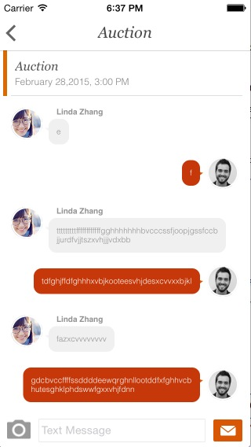

### 变更记录
| 序号 | 录入时间 | 录入人 | 备注 |
| -- | -- | -- | -- |
| 1 | 2015-04-01 | Alfred Jiang | - |

### 方案名称
动态修改 UITableViewCell 高度

### 方案类型（推荐 or 参考）
推荐方案

### 关键字
UITableView \ UITableViewCell \ 高度 \ 动态调整高度

### 需求场景
1. 需要根据不同内容动态显示 Cell 高度时

### 参考链接
1. [动态计算UITableViewCell高度详解](http://www.ifun.cc/blog/2014/02/21/dong-tai-ji-suan-uitableviewcellgao-du-xiang-jie/)
2. [使用Autolayout实现UITableView的Cell动态布局和高度动态改变](http://codingobjc.com/blog/2014/10/15/shi-yong-autolayoutshi-xian-uitableviewde-celldong-tai-bu-ju-he-ke-bian-xing-gao/)

### 详细内容

#####1. 基本原理

1. 通过对 UITableViewCell 中显示文字相关控件大小的计算，得出理想的显示控件大小；
2. 根据显示控件大小，计算出合适的 Cell 高度；
3. 在 UITableView reloadData 时，通过 UITableView 的 heightForRowAtIndexPath 方法返回合适的 Cell 高度。

#####2. 示例

######1. Swift 示例

示例一 : 使用 sizeThatFits

    var itemCell : UITableViewCell?

    itemCell = tableViewMain.dequeueReusableCellWithIdentifier("REXProjectInfoItemCell") as? REXProjectInfoItemCell

    func tableView(tableView: UITableView, heightForRowAtIndexPath indexPath: NSIndexPath) -> CGFloat {

        var cell :REXProjectInfoItemCell = self.itemCell as REXProjectInfoItemCell

        cell.labelTitle.text = "Auction Invite Welcome Message (Text Note)"
        cell.labelInfo.text = "You've been invited to participate in the upcoming auction for the SAP Sales & Distribution Lead……….."

        var s : CGSize  =  cell.labelInfo.sizeThatFits(CGSizeMake(WIDTHSCREEN - 50, CGFloat(FLT_MAX)))
        var defaultHeight : CGFloat  = cell.contentView.frame.size.height
        var height : CGFloat = s.height + 36 > defaultHeight ? s.height + 36 : defaultHeight

        return 1  + height
    }

注意：
1. 用于显示较长文字的控件 labelInfo 需要设置 Lines 属性为 0；设置 Line Breaks 属性为 Word Wrap; 这样才能正确换行
2. sizeThatFits 函数的参数是限宽不限高（用于计算高度）或者限高不限宽（用于计算宽度）的，所限制的宽或者高根据页面布局需求设定
3. 避免因为显示文字内容过短或为空导致计算高度过小，需要设置 defaultHeight , defaultHeight 可根据自定义 Cell 的默认 Frame 计算出。
4. 示例中的 36 是 padding 值，即除了显示文字控件自己高度外，控件本身距离 Cell 上下边界的高度。
5. 最后的 +1 操作是因为默认的 Cell 高度要比 contentView 高度高 1 个像素，具体可查看自定义 Cell 的 Xib 文件。为了正常显示，需要执行 +1 操作。

示例二 : 使用 systemLayoutSizeFittingSize

    var receiveCell: REXMessageReceiveReplyCell!

    tableViewMain.registerNib(UINib(nibName: "REXBidHistoryItemCell", bundle: nil), forCellReuseIdentifier: "REXBidHistoryItemCell")
    receiveCell = tableViewMain.dequeueReusableCellWithIdentifier("REXMessageReceiveReplyCell") as? REXMessageReceiveReplyCell

    func tableView(tableView: UITableView, heightForRowAtIndexPath indexPath: NSIndexPath) -> CGFloat {
            let message: Message = messagesList.objectAtIndex(indexPath.row) as Message
            receiveCell.labelInfo.text = message.mInfo
            let size = receiveCell.contentView.systemLayoutSizeFittingSize(UILayoutFittingCompressedSize)
            return size.height + 1 < 65.0 ? 65.0 : size.height + 1
        }

注意：
1. labelInfo 距离左右端约束中，可变的那一端设置约束条件为 >= 或 <= ，不可变的那一端约束条件设置为 =
2. 避免因为显示文字内容过短或为空导致计算高度过小，需要设置 defaultHeight , defaultHeight 可根据自定义 Cell 的默认 Frame 计算出。以上示例中 defaultHeight 为 65.0
4. labelInfo 作为主要的约束参考条件，避免外部默认约束影响 labelInfo 的默认约束，比如 UIImageView

######1. Objective-C 示例

1. 声明一个存计算Cell高度的实例变量
        @property (nonatomic, strong) UITableViewCell *prototypeCell;

2. 初始化它
        self.prototypeCell  = [self.tableView dequeueReusableCellWithIdentifier:@"C1"];

3. 以下是实现部分
        //注册自定义 Cell
        UINib *cellNib = [UINib nibWithNibName:@"C1" bundle:nil];
        [self.tableView registerNib:cellNib forCellReuseIdentifier:@"C1"];

        //初始化显示数据
        self.tableData = @[@"1\n2\n3\n4\n5\n6", @"123456789012345678901234567890", @"1\n2", @"1\n2\n3", @"1"];

        //实现必要的 UITableViewDelegate 和 UITableViewDataSource
        - (UITableViewCell *)tableView:(UITableView *)tableView cellForRowAtIndexPath:(NSIndexPath *)indexPath
        {
            C5 *cell = [self.tableView dequeueReusableCellWithIdentifier:@"C5"];
            cell.t.text = @"123";
            cell.t.delegate = self;
            return cell;
        }

        - (NSInteger)tableView:(UITableView *)tableView numberOfRowsInSection:(NSInteger)section
        {
            // Return the number of rows in the section.
            return self.tableData.count;
        }

        - (UITableViewCell *)tableView:(UITableView *)tableView cellForRowAtIndexPath:(NSIndexPath *)indexPath
        {
            C1 *cell = [self.tableView dequeueReusableCellWithIdentifier:@"C1"];
            cell.t.text = [self.tableData objectAtIndex:indexPath.row];
            return cell;
        }

        //下面是计算高度的代码
        #pragma mark - UITableViewDelegate
        - (CGFloat)tableView:(UITableView *)tableView heightForRowAtIndexPath:(NSIndexPath *)indexPath {
            C5 *cell = (C5 *)self.prototypeCell;
            cell.t.text = self.updatedStr;
            CGSize s =  [cell.t sizeThatFits:CGSizeMake(cell.t.frame.size.width, FLT_MAX)];
            CGFloat defaultHeight = cell.contentView.frame.size.height;
            CGFloat height = s.height > defaultHeight ? s.height : defaultHeight;
            return 1  + height;
        }

        #pragma mark - UITextViewDelegate
        - (BOOL)textView:(UITextView *)textView shouldChangeTextInRange:(NSRange)range replacementText:(NSString *)text {
            if ([text isEqualToString:@"\n"]) {
                NSLog(@"h=%f", textView.contentSize.height);
            }
            return YES;
        }

        - (void)textViewDidChange:(UITextView *)textView {
            self.updatedStr = textView.text;
            [self.tableView beginUpdates];
            [self.tableView endUpdates];
        }

### 效果图

### 备注

1. UILabel 的 preferredMaxLayoutWidth 属性会严重影响高度的计算，确保该属性在不同尺寸屏幕上均设置为正确的参数。
2. Select the Tighten Letter Spacing (adjustsLetterSpacingToFitWidth) checkbox if you want the spacing between letters to be adjusted to fit the string within the label’s bounding rectangle.[参考链接](https://developer.apple.com/library/ios/documentation/UserExperience/Conceptual/UIKitUICatalog/UILabel.html)

        import UIKit

        class REXInfoLabel: UILabel {

            override func layoutSubviews() {
                self.preferredMaxLayoutWidth = UIScreen.mainScreen().applicationFrame.size.width - 60
                super.layoutSubviews()
            }
        }

        import UIKit

        class REXHelpCell: UITableViewCell {

            @IBOutlet weak var labelQuestion: REXInfoLabel!
            @IBOutlet weak var labelAnswer: REXInfoLabel!

            override func awakeFromNib() {
                super.awakeFromNib()

                self.labelQuestion.layoutSubviews()
                self.labelAnswer.layoutSubviews()
            }
        }

     func tableView(tableView: UITableView, heightForRowAtIndexPath indexPath: NSIndexPath) -> CGFloat {

            var receiveCell : REXHelpCell = REXHelpCell.loadFromNibNamed("REXHelpCell", bundle: nil) as REXHelpCell

            var help : HelpItem = helpItems.objectAtIndex(indexPath.row) as HelpItem

            receiveCell.labelQuestion.text = help.strQuestion

            var height : CGFloat =  0.0
            var defaultHeight : CGFloat  = 0

            if help.isOpen
            {
                receiveCell.labelAnswer.text = help.strAnswer
            }
            else
            {
                receiveCell.labelAnswer.text = ""
            }

            let size = receiveCell.contentView.systemLayoutSizeFittingSize(UILayoutFittingCompressedSize)

            return size.height + 1 < defaultHeight ? defaultHeight : size.height + 1
        }
