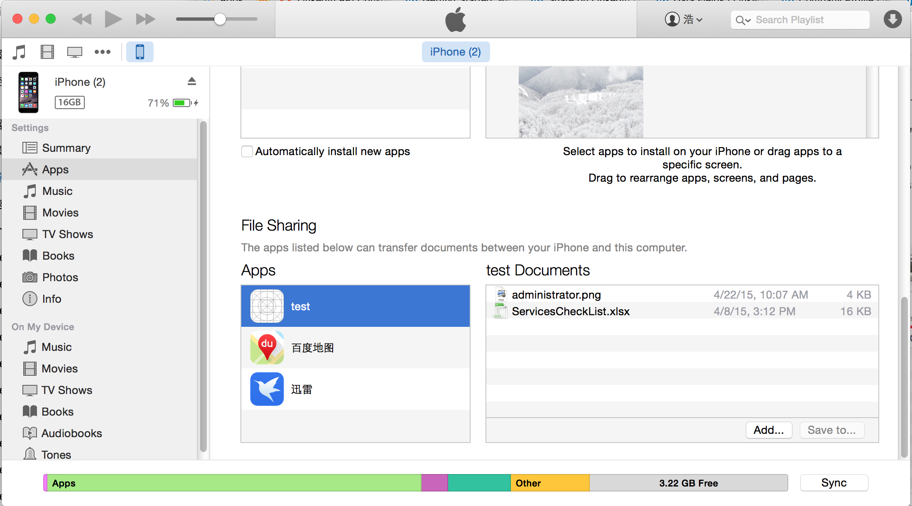

### 变更记录
| 序号 | 录入时间 | 录入人 | 备注 |
| -- | -- | -- | -- |
| 1 | 2015-04-25 | Alfred Jiang | - |

### 方案名称
iOS 文档导入导出实现

### 方案类型（推荐 or 参考）
推荐方案

### 关键字
文档 \ 文档导入 \ 文档导出 \ 其他应用共享打开

### 需求场景
1. 需要将自己应用内文档分享到其他应用打开时
2. 需要自己的应用打开其他应用中的文档时

### 参考链接
1. [Importing & Exporting Documents in iOS](http://mobiforge.com/design-development/importing-exporting-documents-ios)
2. [iOS App让自己的应用在其他应用中打开列表中显示](http://blog.csdn.net/totogo2010/article/details/29182385)

### 详细内容

#### 1. 导出自己应用内文档到其他应用打开

1. ViewController.h
        //
        //  ViewController.h
        //  test
        //
        //  Created by Alfred Jiang on 4/25/15.
        //  Copyright (c) 2015 Alfred Jiang. All rights reserved.
        //

        #import <UIKit/UIKit.h>

        @interface ViewController : UIViewController<UIDocumentInteractionControllerDelegate>

        - (IBAction)btnDisplayFiles:(id)sender;
        - (void)openDocumentIn;

        @end

2. ViewController.m
        //
        //  ViewController.m
        //  test
        //
        //  Created by Alfred Jiang on 4/25/15.
        //  Copyright (c) 2015 Alfred Jiang. All rights reserved.
        //

        #import "ViewController.h"

        @interface ViewController ()

        @property (nonatomic,strong) UIDocumentInteractionController *documentController;

        @end

        @implementation ViewController
        @synthesize documentController;

        - (void)viewDidLoad {
            [super viewDidLoad];
        }

        - (void)didReceiveMemoryWarning {
            [super didReceiveMemoryWarning];
        }

        - (IBAction)btnDisplayFiles:(id)sender
        {
            [self openDocumentIn];
        }

        -(void)openDocumentIn {
            NSString * filePath = [[NSBundle mainBundle] pathForResource:@"ee" ofType:@"pdf"];
            documentController = [UIDocumentInteractionController interactionControllerWithURL:[NSURL fileURLWithPath:filePath]];
            documentController.delegate = self;
            documentController.UTI = @"com.adobe.pdf";
            [documentController presentOpenInMenuFromRect:CGRectZero inView:self.view animated:YES];
        }

        -(void)documentInteractionController:(UIDocumentInteractionController *)controller willBeginSendingToApplication:(NSString *)application {
            NSLog(@"documentInteractionController : willBeginSendingToApplication");
        }

        -(void)documentInteractionController:(UIDocumentInteractionController *)controller didEndSendingToApplication:(NSString *)application {
             NSLog(@"documentInteractionController : didEndSendingToApplication");
        }

        -(void)documentInteractionControllerDidDismissOpenInMenu:(UIDocumentInteractionController *)controller {
            NSLog(@"documentInteractionControllerDidDismissOpenInMenu");
        }

        @end

#### 2. 通过 iTunes 传输文档到手机并打开

1. 在 info.plist 中增加 Application supports iTunes file sharing 为 YES (亦可设置 UIFileSharingEnabled 为 YES);

2. 链接 iPhone 至 iTunes ，可在 iPhone -> Apps -> File Sharing 中看到自己应用;

3. 在 iTunes 选中自己应用，点击 Add... 按钮可添加文档至自己应用中；

4. 在自己应用中打开通过 iTunes 传输到应用中的文档

        //
        //  ViewController.h
        //  test
        //
        //  Created by Alfred Jiang on 4/25/15.
        //  Copyright (c) 2015 Alfred Jiang. All rights reserved.
        //

        #import <UIKit/UIKit.h>

        @interface ViewController : UIViewController

        @property (weak, nonatomic) IBOutlet UIWebView *webView;

        - (IBAction)btnDisplayFiles:(id)sender;

        -(void)handleDocumentOpenURL:(NSURL *)url;
        -(void)displayAlert:(NSString *) str;
        -(void)loadFileFromDocumentsFolder:(NSString *) filename;
        -(void)listFilesFromDocumentsFolder;

        @end

        //
        //  ViewController.m
        //  test
        //
        //  Created by Alfred Jiang on 4/25/15.
        //  Copyright (c) 2015 Alfred Jiang. All rights reserved.
        //

        #import "ViewController.h"

        @interface ViewController ()

        @end

        @implementation ViewController

        - (void)viewDidLoad {
            [super viewDidLoad];
        }

        - (void)didReceiveMemoryWarning {
            [super didReceiveMemoryWarning];
            // Dispose of any resources that can be recreated.
        }

        - (IBAction)btnDisplayFiles:(id)sender {
            [self listFilesFromDocumentsFolder];
        }

        - (void)handleDocumentOpenURL:(NSURL *)url {
            NSURLRequest *requestObj = [NSURLRequest requestWithURL:url];
            [_webView setUserInteractionEnabled:YES];
            [_webView loadRequest:requestObj];
        }

        -(void)loadFileFromDocumentsFolder:(NSString *) filename {
            //---get the path of the Documents folder---
            NSArray *paths = NSSearchPathForDirectoriesInDomains(
                                                                 NSDocumentDirectory, NSUserDomainMask, YES);
            NSString *documentsDirectory = [paths objectAtIndex:0];
            NSString *filePath = [documentsDirectory
                                  stringByAppendingPathComponent:filename];
            NSURL *fileUrl = [NSURL fileURLWithPath:filePath];
            [self handleDocumentOpenURL:fileUrl];
        }

        -(void)listFilesFromDocumentsFolder {
            //---get the path of the Documents folder---
            NSArray *paths = NSSearchPathForDirectoriesInDomains(
                                                                 NSDocumentDirectory, NSUserDomainMask, YES);
            NSString *documentsDirectory = [paths objectAtIndex:0];

            NSFileManager *manager = [NSFileManager defaultManager];
            NSArray *fileList =
            [manager contentsOfDirectoryAtPath:documentsDirectory error:nil];
            NSMutableString *filesStr =
            [NSMutableString stringWithString:@"Files in Documents folder \n"];
            for (NSString *s in fileList){
                [filesStr appendFormat:@"%@ \n", s];
            }

            [self loadFileFromDocumentsFolder:@"ee.pdf"];
        }

        @end

#### 3. 在其他应用中调用自己的应用打开系统支持的默认文档

1. 在 info.plist 中增加如下 字段
        <key>CFBundleDocumentTypes</key>
        <array>
    		<dict>
    			<key>CFBundleTypeName</key>
        		<string>PDF Document</string>
        		<key>LSHandlerRank</key>
        		<string>Alternate</string>
        		<key>CFBundleTypeRole</key>
        		<string>Viewer</string>
        		<key>LSItemContentTypes</key>
        		<array>
        			<string>com.adobe.pdf</string>
        		</array>
        	</dict>
        </array>

2. ViewController 代码实现如下
        //
        //  ViewController.h
        //  test
        //
        //  Created by Alfred Jiang on 4/25/15.
        //  Copyright (c) 2015 Alfred Jiang. All rights reserved.
        //

        #import <UIKit/UIKit.h>

        @interface ViewController : UIViewController

        @property (weak, nonatomic) IBOutlet UIWebView *webView;

        -(void)handleDocumentOpenURL:(NSURL *)url;

        @end

        //
        //  ViewController.m
        //  test
        //
        //  Created by Alfred Jiang on 4/25/15.
        //  Copyright (c) 2015 Alfred Jiang. All rights reserved.
        //

        #import "ViewController.h"

        @interface ViewController ()

        @end

        @implementation ViewController
        @synthesize webView;

        - (void)viewDidLoad {
            [super viewDidLoad];
        }

        - (void)didReceiveMemoryWarning {
            [super didReceiveMemoryWarning];
            // Dispose of any resources that can be recreated.
        }

        - (void)handleDocumentOpenURL:(NSURL *)url {
            NSURLRequest *requestObj = [NSURLRequest requestWithURL:url];
            [self.webView setUserInteractionEnabled:YES];
            [self.webView loadRequest:requestObj];
        }

        @end

3. 在 Appdelegate.m 中增加如下代码
        -(BOOL)application:(UIApplication *)application openURL:(NSURL *)url sourceApplication:(NSString *)sourceApplication annotation:(id)annotation {
            if (url != nil && [url isFileURL]) {
                [(ViewController *)self.window.rootViewController handleDocumentOpenURL:url];
            }
            return YES;
        }

4. 在支持 “用其他应用打开” 选项的应用中就可以看到自己的应用了

#### 4. 在其他应用中调用自己的应用打开自定义文档

1. 在 info.plist 中增加如下 字段
        <key>CFBundleDocumentTypes</key>
        	<array>
        		<dict>
        			<key>CFBundleTypeName</key>
        			<string>Sudoku Game Document</string>
        			<key>LSHandlerRank</key>
        			<string>Owner</string>
        			<key>CFBundleTypeRole</key>
        			<string>Editor</string>
        			<key>LSItemContentTypes</key>
        			<array>
        				<string>net.learn2develop.offlinereader.sdk</string>
        			</array>
        		</dict>
        	</array>
        	<key>UTExportedTypeDeclarations</key>
        	<array>
        		<dict>
        			<key>UTTypeConformsTo</key>
        			<array>
        				<string>public.data</string>
        			</array>
        			<key>UTTypeTagSpecification</key>
        			<dict>
        				<key>public.filename-extension</key>
        				<string>testextension</string>
        				<key>public.mime-type</key>
        				<string>application/test</string>
        			</dict>
        			<key>UTTypeIdentifier</key>
        			<string>net.learn2develop.offlinereader.sdk</string>
        			<key>UTTypeDescription</key>
        			<string>Sudoku Game Document</string>
        		</dict>
        	</array>

1. 在其他应用中选择 “用其他应用打开” 选项的应用中就可以看到自己的应用了

### 效果图
（无）

### 备注
