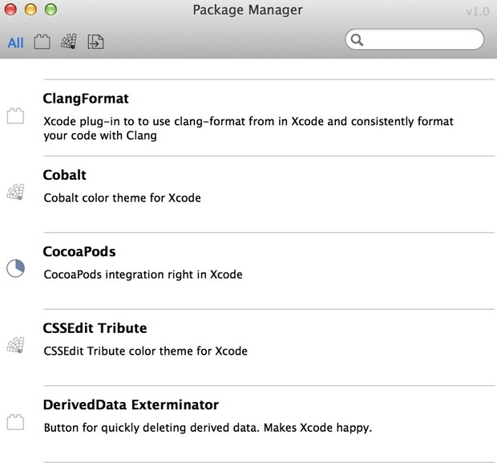

### 变更记录
| 序号 | 录入时间 | 录入人 | 备注 |
| -- | -- | -- | -- |
| 1 | 2015-03-25 | Alfred Jiang | - |

### 方案名称
Xcode 插件的使用与介绍

### 方案类型（推荐 or 参考）
推荐方案

### 关键字
Xcode \ 插件

### 需求场景
1. 提高 Xcode 开发效率

### 参考链接
1. [使用Alcatraz来管理Xcode插件](http://blog.devtang.com/blog/2014/03/05/use-alcatraz-to-manage-xcode-plugins/)
2. [xcode一些有用的小插件](http://www.jianshu.com/p/baa5c73a08cf?nomobile=yes)
3. [那些不能错过的Xcode插件](http://www.cocoachina.com/industry/20130918/7022.html)

### 详细内容

#####1. 使用如下的命令行来安装 Alcatraz
    mkdir -p ~/Library/Application\ Support/Developer/Shared/Xcode/Plug-ins;
    curl -L http://git.io/lOQWeA | tar xvz -C ~/Library/Application\ Support/Developer/Shared/Xcode/Plug-ins

卸载命令

    rm -rf ~/Library/Application\ Support/Developer/Shared/Xcode/Plug-ins/Alcatraz.xcplugin
    rm -rf ~/Library/Application\ Support/Alcatraz

#####2. 在下面位置打开安装的 Alcatraz 插件管理器

#####3. 选择喜欢的插件进行安装

#####4. 插件路径

    ~/Library/Application Support/Developer/Shared/Xcode/Plug-ins/

#####5. Xcode 6.2 插件失效解决方法

进入下面目录，

    ~/Library/Application Support/Developer/Shared/Xcode/Plug-ins/

编辑各个插件目录下的Info.plist文件，找到DVTPlugInCompatibilityUUIDs这段，将新的UUID加进去，重启Xcode。

    <string>A16FF353-8441-459E-A50C-B071F53F51B7</string>

#####6. 推荐插件
1. [FuzzyAutocompletePlugin](https://github.com/FuzzyAutocomplete/FuzzyAutocompletePlugin) 代码自动补全
2. [VVDocumenter-Xcode](https://github.com/onevcat/VVDocumenter-Xcode) 快速生成注释
3. [KSImageNamed-Xcode](https://github.com/ksuther/KSImageNamed-Xcode) 在代码中预览图片
4. [SCXcodeSwitchExpander](https://github.com/stefanceriu/SCXcodeSwitchExpander) 快速补全 Switch 的 Case

### 效果图
（无）

### 备注
（无）
